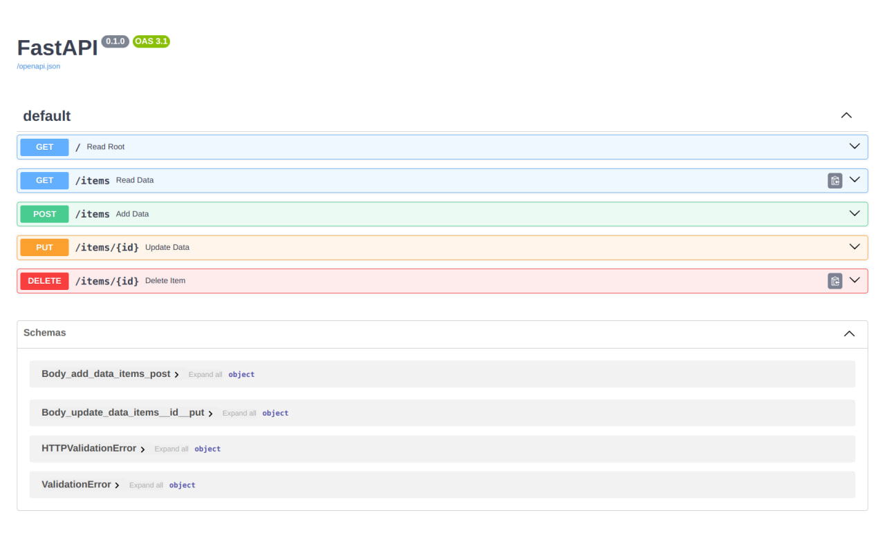
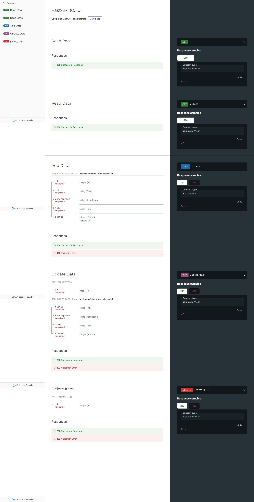

# Fast API | Docker

I'll show you how to build a **Docker** image for **FastAPI** from scratch, based on the official Python image.

## ToDo App

In this api there is requests for `READ`, `ADD`, `UPDATE` and `REMOVE` from database.<br>
Use the following commands to run the program.
Database API:

```
uvicorn main:app --reload
```

## Liara

Liara's URL is https://keen-pare-fj5smoptv.liara.run/

## Build Docker

The most common way to do it is to have a file requirements.txt with the package names and their versions, one per line.

```
pip install -r requirements.txt
```

### Create the FastAPI Code<hr>

- Create an `app` directory and enter it.
- Create a [`main.py`](https://github.com/SinaHosseini/PyDeployment/blob/1241c133a2705531bc2ab283655c1c494222dfcf/1.5FastAPIDocker/app/main.py) file.

### DockerFile <hr>

Now in the same project directory create a file [`Dockerfile`](https://github.com/SinaHosseini/PyDeployment/blob/4e50ed613a7b8b36830d7a54f275f1ab76a26be2/1.5FastAPIDocker/Dockerfile)

### Build the Docker Image<hr>

Now that all the files are in place, let's build the container image.

- Go to the project directory (in where your `Dockerfile` is, containing your `app` directory).
- Build your FastAPI image:

```
docker build -t myimage .
```

### Start the Docker Container<hr>

- Run a container based on your image:

```
docker run -d --name mycontainer -p 80:80 myimage
```

### Interactive API docs<hr>

Now you can go to http://192.168.99.100/docs or http://127.0.0.1/docs (or equivalent, using your Docker host).

You will see the automatic interactive API documentation (provided by Swagger UI):<br>
<br><br>

### Alternative API docs<hr>

And you can also go to http://192.168.99.100/redoc or http://127.0.0.1/redoc (or equivalent, using your Docker host).

You will see the alternative automatic documentation (provided by ReDoc):


### Docker command

Docker commands can be followed from the link below:<br>
[Cheat Sheet](https://docs.docker.com/get-started/docker_cheatsheet.pdf)
