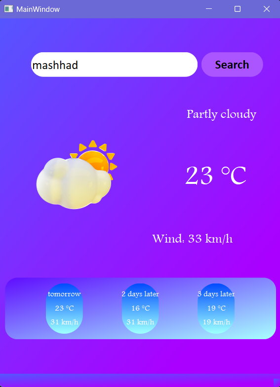
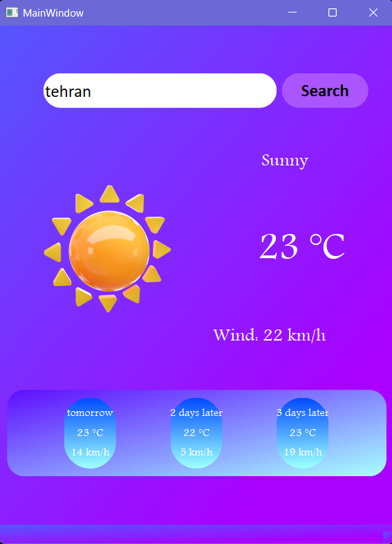

# Waether App

Make a weather application using API and Qt Designer

## API

https://goweather.herokuapp.com/weather/%7Blocation%7D

## installation

```
pip install -r requirements.txt
```

## result




